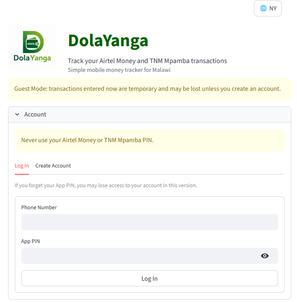
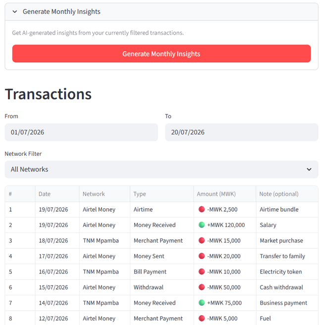
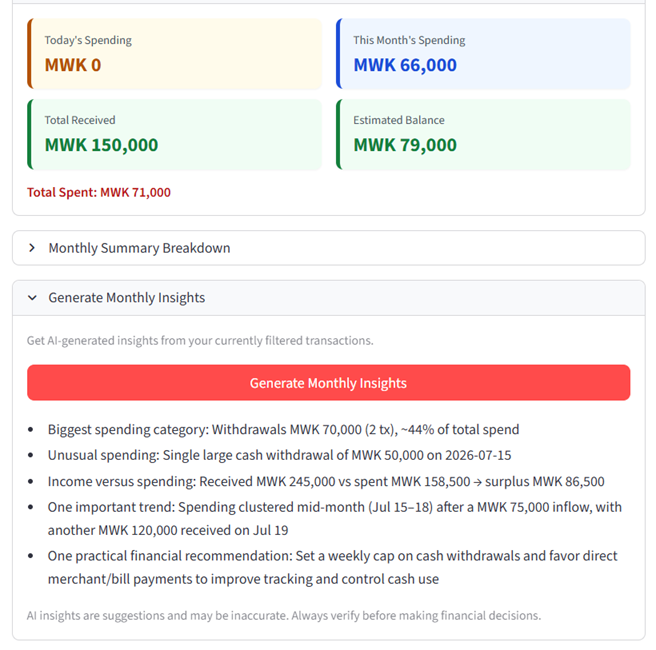
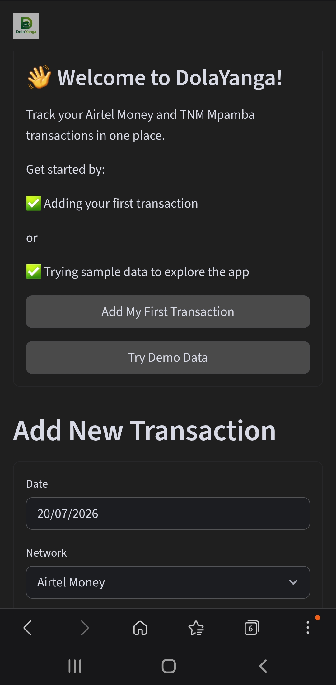

# DolaYanga

## AI-Powered Mobile Money Transaction Tracker for Malawi

DolaYanga is a secure bilingual Streamlit application designed for users of Airtel Money and TNM Mpamba, the two leading mobile money platforms in Malawi.

The application helps users understand and manage their mobile money activity by enabling them to:

- Securely record mobile money transactions
- Track income and expenses
- Monitor balances
- View daily and monthly summaries
- Export transaction reports
- Generate AI-powered Monthly Insights based on their own transaction history

DolaYanga supports both **English** and **Chichewa**, making financial tracking more accessible to a wider range of users in Malawi.

---

## Why I Built DolaYanga

Mobile money is a major part of everyday financial activity in Malawi. Millions of people use mobile money services to send, receive, and manage money, but many users have limited tools to understand their spending patterns and financial behaviour.

DolaYanga was created to provide a simple, secure, and locally relevant solution that helps users:

- Understand where their money is going
- Track income and expenses
- Identify spending trends
- Make better financial decisions

The application was designed specifically around the needs of Malawian mobile money users, including support for local services, local currency, and Chichewa language accessibility.

---

# OpenAI Build Week Enhancements

DolaYanga existed before OpenAI Build Week.

During the Build Week submission period, the project was meaningfully extended using OpenAI Codex and GPT-5-powered AI capabilities. New functionality and improvements added during Build Week include:

- GPT-powered AI Monthly Insights
- AI-generated financial observations and recommendations
- Bilingual AI responses in English and Chichewa
- Improved transaction analysis
- Mobile user experience improvements
- Fixes for transaction table rendering when switching languages
- Improved AI response handling and reliability
- Updated project documentation

These enhancements were designed, implemented, tested, and refined during the Build Week submission period using OpenAI Codex.

---

# How Codex Helped Build DolaYanga

OpenAI Codex was used throughout the Build Week period as an engineering assistant to accelerate development, debugging, testing, and refinement.

Codex helped with:

- Implementing the GPT-powered Monthly Insights feature
- Debugging OpenAI Responses API integration issues
- Improving AI response extraction and validation
- Refining bilingual English and Chichewa support
- Resolving Streamlit mobile rendering issues
- Improving transaction table stability after language switching
- Reviewing implementation approaches while preserving existing authentication and database logic
- Supporting iterative testing and product refinement

Key product decisions, including the focus on Malawian mobile money users, bilingual accessibility, privacy, and practical financial insights, were driven by the application's intended users and use case.

---

# GPT-Powered Monthly Insights

The AI Monthly Insights feature analyzes a user's own transaction history and generates concise financial observations including:

- Biggest spending category
- Unusual spending activity
- Income versus expenses
- Spending trends
- Practical financial recommendations

Insights are generated from the user's transaction data and respect the selected application language.

The AI feature is designed to provide helpful suggestions and should not replace professional financial advice. Users are encouraged to verify information before making financial decisions.

## Screenshots

### Login



### Transaction Dashboard



### GPT-5 Monthly Insights



### Mobile Experience



---

# Features

## Transaction Management

Users can:

- Record income and expenses
- Categorize transactions
- Add transaction notes
- Track Airtel Money and TNM Mpamba activity
- Review transaction history

## Financial Overview

Users can view:

- Current balance
- Income totals
- Expense totals
- Monthly summaries
- Spending patterns

## Bilingual Experience

DolaYanga supports:

- English
- Chichewa

Language selection applies throughout the application, including AI-generated insights.

## Secure Design

DolaYanga uses secure configuration practices:

- API credentials are stored using Streamlit Secrets
- Secrets are not committed to GitHub
- User transaction data is kept separate from application code

---

# Demo

A demo mode is available for testing the application without creating an account.

The demo allows users to test:

- Dashboard summaries
- Transaction tracking
- Language switching
- AI Monthly Insights

---

# Technology Stack

- Python
- Streamlit
- Supabase
- Pandas
- OpenAI API (GPT-5)
- OpenAI Codex

---

# Installation

Clone the repository:

```bash
git clone https://github.com/dolacorehq-alt/DolaYanga-App.git
cd DolaYanga-App
